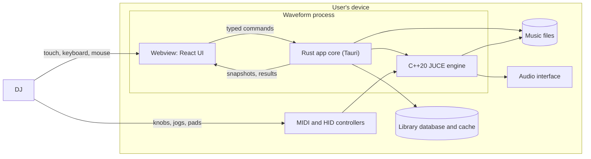
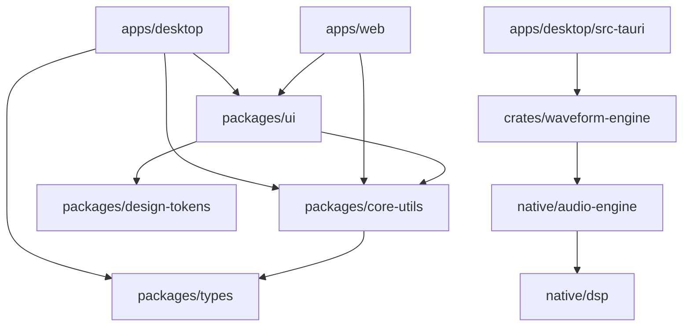
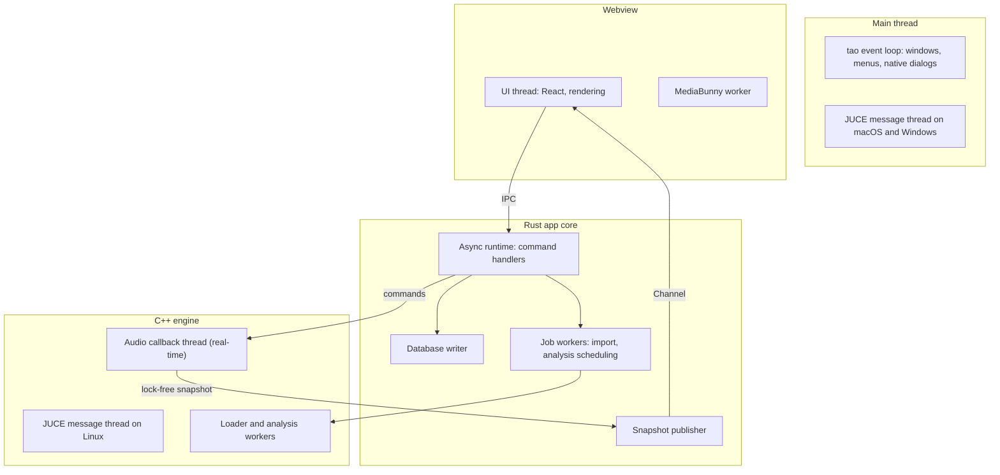
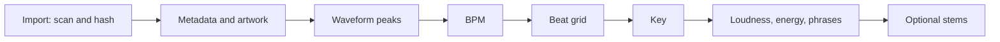

# Architecture

This document describes how Waveform is put together: the layers, the threads, the data, and
the rules that keep them apart. The reasons behind each choice are in
[TECH_DECISIONS.md](TECH_DECISIONS.md); the order of work is in [ROADMAP.md](ROADMAP.md).

Every section is tagged with its status:

- **Implemented**: exists in the repository and is covered by tests.
- **Planned (Phase N)**: designed but not built. Nothing tagged Planned works yet.

## System context

Status: **Implemented** for the process itself: the webview, the Rust core and the engine
run together (Phase 1). **Planned (Phases 3–7)** for music files, the library, audio output
and controllers.

Waveform is a local-first desktop and tablet application. It runs entirely on the user's
device. It makes no network requests unless the user asks for something that needs one
(ADR-019).



## Layers and responsibilities

Status: **Implemented** (Phase 1)

Waveform has three layers. Calls go in one direction only: the UI calls the core, and the
core calls the engine. Information flows back as results and snapshots, never as calls into
a higher layer.

| Layer               | Runs in                   | Owns                                                                                                 | Never does                                                                |
| ------------------- | ------------------------- | ---------------------------------------------------------------------------------------------------- | ------------------------------------------------------------------------- |
| UI (React)          | System webview            | Presentation, interaction, waveform rendering, client-side media inspection (MediaBunny worker)      | Touch the filesystem or database directly; run audio                      |
| App core (Rust)     | Tauri process             | Library, database, background jobs, filesystem access, IPC, hosting the engine, platform integration | Run on the audio thread; process audio samples                            |
| Engine (C++20/JUCE) | Same process, own threads | Audio devices, real-time playback, mixing, DSP, MIDI input, offline analysis                         | Call into Rust or JavaScript; block, allocate or lock on the audio thread |

Neither JavaScript nor Rust ever runs on the audio thread. All real-time code is C++.

## Repository layout and dependency rules

Status: **Implemented** (Phase 1)

```text
apps/desktop             Tauri 2 app: React UI (src/) and Rust app crate (src-tauri/)
apps/web                 Website: Next.js, static export; Playwright tests in e2e/
packages/config          Shared ESLint, Prettier and tsconfig settings
packages/ui              Shared shadcn components and the Waveform brand mark
packages/design-tokens   Colour, type, spacing, density and motion tokens (Phase 2)
packages/types           Shared TypeScript types
packages/core-utils      Pure helpers: time, BPM, pitch and level formatting
crates/waveform-engine   Safe Rust API over the C++ engine (cxx bridge)
native/cmake             Pinned dependency downloads and shared compiler warnings
native/juce              waveform_juce: the JUCE modules, built once as a static library
native/dsp               waveform_dsp: pure C++20 DSP, no JUCE dependency
native/audio-engine      waveform_engine: the JUCE-based engine
assets/brand             The official icon and the sources derived from it
scripts/                 Repository scripts: C++ format check, clean-checkout check
.github/workflows        Continuous integration
```

End-to-end tests live next to the app they test, rather than in a shared top-level folder.

The folders the spec lists for later phases (`packages/media`, `packages/audio-protocol`,
`native/analysis`, `native/controller`, `native/platform`, `models/`) are created when the
phase that needs them starts, not before.

Package dependency rules, enforced by Turborepo boundaries tags:



- Packages never import from apps.
- `packages/ui` must not import Tauri or Next.js APIs, so it renders the same in both apps
  and in tests.
- `packages/core-utils` and `packages/types` have no runtime dependencies on React.
- `native/dsp` must not depend on JUCE, so its algorithms can be tested in isolation.

## Process and thread model

Status: **Implemented** for the main thread and the JUCE message thread (Phase 1).
**Planned (Phases 3–5)** for the others.



| Thread                      | Owner                      | Rules                                                                           |
| --------------------------- | -------------------------- | ------------------------------------------------------------------------------- |
| Main thread                 | tao (Tauri)                | Never blocked. On macOS and Windows it is also JUCE's message thread (ADR-005). |
| JUCE message thread (Linux) | Engine                     | Runs JUCE's dispatch loop: device changes, timers, async callbacks.             |
| Async runtime               | Tauri (tokio)              | Command handlers. Anything that blocks moves to a dedicated thread.             |
| Database writer             | App core                   | The only connection that writes. Reads use separate read-only connections.      |
| Job workers                 | App core                   | Import and analysis scheduling. Below-normal priority, cancellable.             |
| Loader and analysis workers | Engine                     | Decoding and analysis. Never touch device state.                                |
| Audio callback              | Operating system audio API | Real-time. See the rules below.                                                 |
| Webview UI thread           | Webview                    | Rendering only. Heavy parsing goes to workers.                                  |

## Audio engine boundary

Status: **Implemented** for the Phase 1 skeleton: build information and the runtime
lifecycle ([AUDIO_ENGINE.md](AUDIO_ENGINE.md)). **Planned (Phase 3)** for the engine itself.

The engine is a C++20 static library with a small public API in plain C++ types. JUCE types
stay behind a PIMPL facade. The Rust crate `crates/waveform-engine` wraps that API with
`cxx` and exposes a safe Rust interface. Tauri commands call the Rust interface.

What crosses the boundary:

| Direction      | Content                                             | Mechanism                                                         |
| -------------- | --------------------------------------------------- | ----------------------------------------------------------------- |
| Core to engine | Commands: load, play, cue, set gain, set crossfader | Fixed-size messages into a pre-allocated lock-free queue          |
| Engine to core | State snapshots: positions, levels, deck state      | Triple buffer or seqlock, read by the snapshot publisher          |
| Engine to core | Events: device lost, track ended, analysis finished | Lock-free event queue, drained off the audio thread               |
| Engine to core | Bulk results: waveform peaks, analysis data         | Written to files or buffers by workers, never by the audio thread |

Phase 1 implements only the build information query and the JUCE runtime lifecycle, which
prove the bridge and the message loop work (ADR-005).

### Real-time rules

Status: **Planned (Phase 3)**

The audio callback thread is a hard real-time environment. On it, Waveform never:

- reads or writes files, uses the network, or queries the database;
- allocates or frees memory;
- takes locks or waits on other threads;
- logs through anything that can block;
- runs ML inference, parses metadata, or touches UI.

How the engine keeps those rules:

- Commands arrive through a single-producer/single-consumer lock-free queue with fixed
  capacity. All producers are serialised onto one control producer first.
- Buffers are sized when the device starts (`prepareToPlay`), never in the callback.
- New large objects are swapped in by pointer. Retired objects go back through a queue and
  are freed on the control thread.
- Errors on the audio thread become event codes in a lock-free queue. Logging happens
  elsewhere.
- Denormals are flushed (`juce::ScopedNoDenormals`) and nothing in the callback throws.
- CI runs audio-thread code under RealtimeSanitizer (ADR-015) to catch violations.

### Prepared audio

Status: **Planned (Phase 3; decision in Phase 3)**

The live path follows the spec: track, then prepared audio, then the JUCE engine, then deck,
mixer, DSP, master and audio device. Decks read from audio that loader threads have already
decoded. Phase 3 decides between decoding whole tracks into memory and a chunked cache that
prioritises the regions around the playhead and the hot cues. The deck API hides which one
is used.

## IPC strategy

Status: **Implemented** for typed commands (Phase 1: `engine_info`). **Planned (Phase 3)**
for channels.

| Traffic                        | Mechanism                                               | Rate                |
| ------------------------------ | ------------------------------------------------------- | ------------------- |
| User intents (play, load, set) | Typed Tauri commands generated by tauri-specta          | On demand           |
| Engine state                   | Tauri `Channel`, newest snapshot wins                   | Up to display rate  |
| Playhead between snapshots     | Extrapolated in the UI with `requestAnimationFrame`     | Every frame, no IPC |
| Waveform peaks and binary data | Raw bytes (`tauri::ipc::Response`), `ArrayBuffer` in JS | On demand           |
| Long jobs (import, analysis)   | Command starts the job; a `Channel` reports progress    | Throttled           |

Each snapshot carries the sample position, playback rate and a timestamp, so the UI can draw
a smooth playhead from a few updates per second. Controller input (MIDI and HID) goes
straight to the engine and never round-trips through the webview, so a jog wheel's latency
does not depend on the UI.

## Persistence and cache layout

Status: **Planned (Phase 4)**

SQLite holds metadata and references; the filesystem holds large data (spec §12). The Rust
core owns the database (ADR-009).

```text
<app data dir>/
  library.sqlite            Library database (WAL mode)
  backups/                  Copies taken before each migration
  stems/<aa>/<hash>/        Generated stems (expensive to regenerate)
  models/<id>/<version>/    Downloaded AI models, each with its checksum manifest
<app cache dir>/
  waveforms/<aa>/<hash>-v<n>.peaks   Multi-resolution peak data
  artwork/<aa>/<hash>.<ext>          Cover art extracted from tags
```

- `<hash>` is a content hash of the audio file and `<aa>` its first two characters. The
  hash algorithm is chosen in the Phase 4 benchmark; candidates are BLAKE3 and XXH3-128.
- Artifacts are keyed by content hash, analyser and analyser version. Moving or renaming
  a file does not invalidate them; a new analyser version does.
- Anything in the cache directory can be deleted and regenerated. The data directory holds
  what cannot be regenerated cheaply.
- Schema design happens at the start of Phase 4 and is documented in `docs/DATABASE.md`.
  The spec's entity list (tracks, track files, playlists, cue points, beat grids, analysis,
  history, tags, settings, controller mappings) is the starting point, normalised only
  where it pays off.

## Media pipeline and analysis

Status: **Planned (Phases 4–5)**

Native code decodes audio for playback and analysis. MediaBunny, in a webview worker,
handles inspection, tags, cover art and export (ADR-008).



- Each step is a job with a priority, progress reporting and cancellation. Jobs for the
  track a DJ just loaded jump the queue.
- Results are stored per step, so an interrupted import resumes where it stopped.
- A track can be played before every step has finished whenever it is safe: playback needs
  only decodable audio; sync needs a beat grid.
- Failures are recorded per file, shown to the user in plain language, and retried when the
  file changes (spec §50).

## Music sources

Status: **Planned (Phase 6 and later)**

Every place music comes from is a `MusicSource` with explicit capabilities:

| Capability     | Local files | Authorised streaming (example)        |
| -------------- | ----------- | ------------------------------------- |
| Browse, search | Yes         | Through the provider's official API   |
| Decode locally | Yes         | Only if the provider's terms allow it |
| Analyse        | Yes         | Only if the provider's terms allow it |
| Cache offline  | Yes         | Only if the provider's terms allow it |
| Record the mix | Yes         | Only if the provider's terms allow it |

The UI asks a source what it can do instead of assuming. Waveform never downloads audio
from YouTube, never bypasses DRM, and never scrapes services (spec §15). Local files remain
the first-class source.

## Command registry

Status: **Planned (first commands with the first user actions, palette in Phase 11)**

Every user-invokable action is a command with an id, label, description, keywords,
shortcut, availability rule, parameters and an execute function. The command palette,
keyboard shortcuts, menus, context menus and automation all dispatch through the registry;
there are no ad-hoc key handlers or string comparisons. Controller mappings refer to the
same command ids, but time-critical controls (jog wheels, faders) are handled by the engine
directly so their latency never depends on the webview.

## Platform strategy

Status: **Planned**

| Platform | Shell and webview            | Audio (through JUCE)                                 | Notes                                                                  |
| -------- | ---------------------------- | ---------------------------------------------------- | ---------------------------------------------------------------------- |
| macOS    | Tauri, WKWebView             | CoreAudio                                            | Primary development platform. Minimum: macOS 14.0.                     |
| Windows  | Tauri, WebView2              | WASAPI; ASIO optional (licensing, see LICENSING.md)  | Verified in CI only until someone tests on hardware.                   |
| Linux    | Tauri, WebKitGTK 4.1         | ALSA and JACK (PipeWire provides both)               | WebKitGTK rendering and codec support must be benchmarked (Phase 4).   |
| iPadOS   | Tauri mobile, WKWebView      | iOS audio session                                    | App Store distribution depends on the licence decision. Phase 8.       |
| Android  | Tauri mobile, System WebView | JUCE's Android audio (Oboe); fallback: Oboe directly | Running JUCE inside Tauri's Android activity needs a spike in Phase 8. |

Input environments (spec §3) shape the UI rather than being bolted on:

- Desktop: keyboard, mouse and trackpad, controllers. Compact density.
- Tablet: touch and gestures, optional keyboard and controller. Touch density with targets
  of at least 44 px, adaptive layouts rather than shrunken desktop ones.
- Hardware: MIDI and HID handled natively (Phase 7).

Waveforms render on Canvas 2D first, with OffscreenCanvas in a worker where the webview
supports it, and WebGL2 where Canvas 2D is not fast enough. WebGPU is evaluated per webview
later.

## Security model

Status: **Implemented** for the content security policy and capabilities (Phase 1).
**Planned** for the rest, as the features they protect arrive.

- The webview loads only bundled content. A strict content security policy forbids remote
  scripts, frames and connections.
- Tauri capabilities grant only the commands the UI uses. No generic filesystem, shell or
  HTTP access is exposed to JavaScript. The main window has two permissions: reading engine
  information, and `core:window:allow-set-theme` so the title bar follows the chosen theme.
- File access goes through the Rust core and only to locations the user picked.
- The webview never receives SQL or file paths it did not get from the user or the core.
- Any future update check is opt-in and verifies signatures.

## Performance targets

Status: **Planned (targets, not measurements)**

These are the budgets later phases are designed against. Phase 13 audits them.

| Area    | Target                                                                                       |
| ------- | -------------------------------------------------------------------------------------------- |
| Audio   | Stable playback at 128–256 frames per buffer, 48 kHz, with four decks and effects.           |
| UI      | 60 frames per second while two decks scroll their waveforms.                                 |
| Library | 100,000 tracks: search results in under 50 ms; virtualised scrolling with no dropped frames. |
| Import  | Runs in the background; the UI stays interactive throughout.                                 |
| Startup | Interactive before the library finishes loading. Measured and budgeted in Phase 13.          |

## Testing strategy

Status: **Implemented** for Catch2, `cargo test`, Vitest with React Testing Library,
Playwright, and axe (Phases 1–2). **Planned** for RealtimeSanitizer (Phase 3).

Each layer is tested with its own tools (ADR-015): Catch2 for C++ DSP and engine
behaviour, `cargo test` for the Rust core and the bridge, Vitest and React Testing Library
for TypeScript logic and component behaviour, and Playwright with axe for rendered pages
in Chromium and WebKit. Tests check behaviour, not implementation details.
